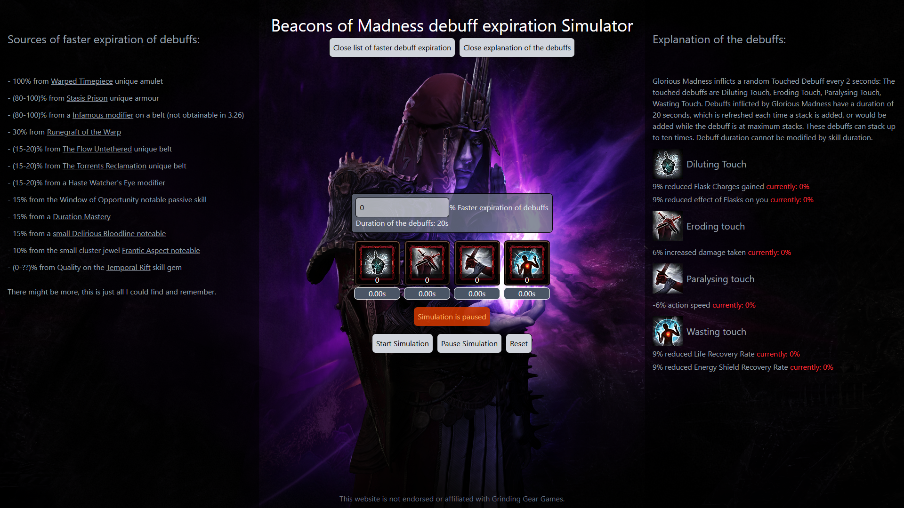

# Beacons of Madness Simulator

### Links

- Live Site URL: [live site on Vercel](https://beacons-of-madness-simulator-j4cfhodot-xoneris-projects.vercel.app)
- PoE Wiki Page: [PoE Wiki](https://www.poewiki.net/wiki/Beacon_of_Madness)

### About

Beacons of Madness are unique boots in Path of Exile. They provide a very strong build enabling buff, but as a drawback every 2 seconds you are inflicted with one of four debuffs, lasting 20 seconds which can stack up to 10 times each. One common way to offset this downside is to get multiple sources of "faster expiration of debuffs". This app is a simulation of how these debuffs would behave realistically with different amounts of expiration of debuffs to give you a feel how it would behave ingame if you had these amounts.

### Features
 
- You can set a number simulating how fast the debuffs will expire
- Displays the number of stacks and the remaining time they stick around
- List of sources where you can obtain faster expiration of debuffs
- Explanation of each debuff

### Built with

- Svelte 5
- Tailwind CSS

## Author

- Website - [Kely.dev](https://kely.dev)
- Twitter - [@xoneris](https://www.twitter.com/xoneris)
